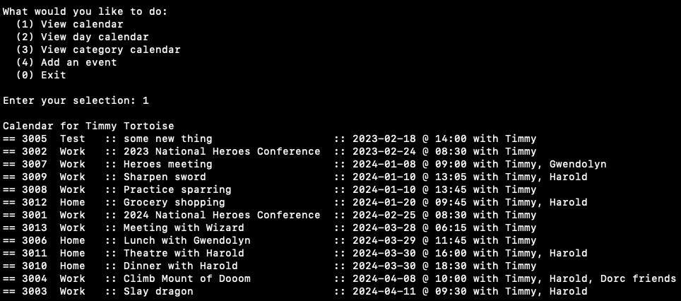

# COMP2404 - Assignment 1
#### Working with References and Header Files
 Creating and Displaying the end user's calendar for a list of events.  The program will allow the user to view their calendar, view events for a specified day, browse by catagory, and it add additional events as needed.


## Sample Courses Output


## Usage
this program uses Makefiles for compilation and linking.

to compile the program, navigate to the folder the program resides and run...
```sh
make
```

to run the program, run...
```sh
./assignment01
```

to clean object files afterwards, run...
```sh
make clean
```
